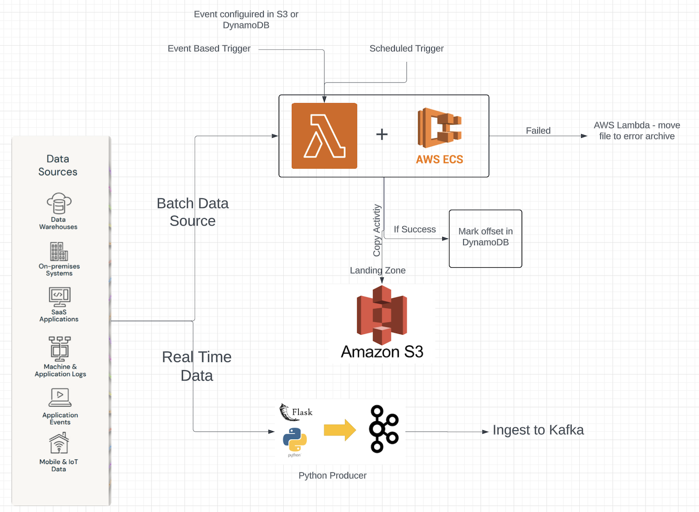

The integration of data sources can be divided into 2:
1) Real time data sources
2) Batch data sources

Batch Data Source:
Since the volume of data is going to be high and at the same time, its important that data duplicity is not a problem, the solution for this needs to be resilient, fault tolerant and ensure there is no stale data being copied. At the same time, the copy activity could be event driven or in scheduled manner depending on the scenario.

Solution:
The solution for this involves combining AWS Lambda + ECS. The lambda can be configured to be triggered upon an event generation for instance an event flag in S3/dynamo db (NoSQL) or in scheduled manner. The Lambda will trigger an ECS cluster which will host the copy app, that can copy data in parallel from source to landing zone (S3). The cluster size will be computed by lambda, by assessing the number of files or getting the metadata statistic of the data. 

Error scenario:
Impartial copy - If ECS fails while moving data, then we can have a periodic lambda (ex: every 15 mins), to check on failed ECS run, and move any of the partial files copied to error archive folder.

Duplicate data:
To avoid data duplicity, following things can be performed:
1) set last successful copy timestamp in dynamoDB or scan the the S3 to find last successful copy, and copy data from source post that.
2) Create an offset, which can highlight upto what point the data was copied, and using that filter new data can be moved.

Real Time Data:
For real time, I have configured a python based producer, that can read data from real time sources such as API's, IOT sensors/devices or other realtime source and ingest data into kafka. 

The python producer APP can be hosted on ec2 instances so that its available throughout communicate with realtime sources and produce the records to be ingested in kafka. 

