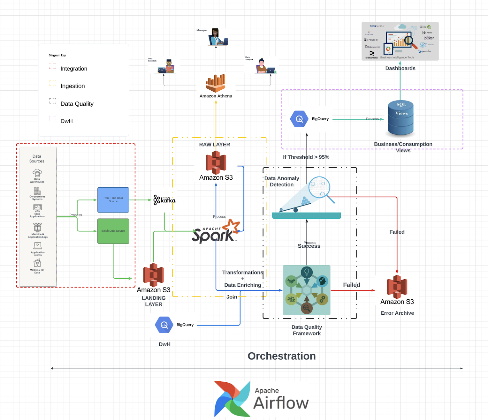

# AdvertiseX-Data-Engineering Case Study

This case study examines AdvertiseX, an adtech firm that enhances digital advertising campaigns for its partners and analyzes market penetration. By leveraging extensive datasets—ranging from ad click data and user demographics to location information—AdvertiseX extracts valuable insights from the vast volumes of data generated through digital ads. The platform's design meticulously accommodates the nature and scale of the data, ensuring efficient processing and meaningful analysis.

The document outlines key design decisions, the technologies considered, and the rationale behind the selection of each technology. Additionally, it discusses recommended DevOps and change management practices.

**Technology stack**
The architecture of this platform capitalizes on cloud technologies known for their high availability, reliability, and low maintenance overhead. This design adopts a hybrid cloud strategy, utilizing both AWS and GCP for their mature, consistently evolving offerings. These providers have proven their robustness and dependability over many years, enhancing their technology stacks through continuous improvements. While this solution is designed with flexibility to adapt to other cloud services, the reliability of alternative technologies would need thorough evaluation. Furthermore, all services are secured behind a VPC, safeguarding them from potential attacks, thereby enhancing the overall security posture.

The overall architecture is divided into multiple phases
1) **Integration**
2) **Ingestion**
3) **Data Quality**
4) **Data Warehouse**
5) **EDA - Exploratory Data Analysis**
6) **Orchestration**

**Integration**:
To source data from various origins, AWS Lambda, ECS, and EC2 have been opted for. These services are cost-effective, support event-driven or scheduled operations, and allow for dynamic computational optimization of data movement applications. Furthermore, they facilitate logging within cloud services, which substantially aids in reducing the time needed for issue resolution from a support perspective.

**Ingestion**:

For the pub/sub system, Apache Kafka is chosen for several compelling reasons:
1) Kafka is inherently distributed, enabling high-throughput data handling by accommodating multiple producers and consumers simultaneously.
2) It ensures fault tolerance through internal replication of topics, safeguarding against data loss.
3) Kafka is a well-established technology that has undergone significant enhancements, such as the ability to perform in-stream data transformations, reducing the latency typically introduced by auxiliary services (unlike systems like Kinesis Data Streams).
4) Kafka offers both managed services and serverless options to cater to a range of deployment preferences.

For data processing, Apache Spark was opted for due to its versatility:

1) Apache Spark is a comprehensive engine that accommodates batch processing, real-time processing, and machine learning tasks.
2) As a distributed system, Spark processes data in parallel, showcasing resilience, fault tolerance, and employing lazy evaluation — it commences processing only upon an action call, which is more efficient than traditional MapReduce.
3) Spark can be accessed as a SaaS, like Databricks, offering additional features for ease of use and eliminating the complexity of cluster configuration and maintenance.
4) Its a matured tech with integration with various source/sinks

**Data Quality**
The design promotes a 2 part solution

I) Data Quality Service
II) ML solution

I) **Data Quality Service**
Data quality is crucial for any data platform, requiring strong validation rules to ensure data accuracy. Some rules actively remove erroneous data during processing, while others may need input from business users or data analysts based on specific operational needs. The selection of a particular service for implementing these rules is left open in the design to maintain flexibility around requirements and budget. Options include open-source Python libraries for config-based quality checks, and comprehensive paid solutions like Collibra, which provide advanced features and support, enhancing the system's reliability and future readiness. The ultimate choice depends on the specific needs and financial constraints of the organization.

II) **Data Anomaly Detection** 
employing a machine learning model trained on high-quality labeled data is essential. Clustering algorithms are a practical choice for identifying and weeding out outliers. The threshold for anomalies typically aligns with business standards; a 95% threshold is often regarded as high quality. However, thresholds can vary based on the trade-off between data pipeline integrity and the permissible impact on data quality. In some projects I've managed, an 80% threshold balanced this consideration, allowing for a certain degree of leniency in the data pipeline while maintaining acceptable data quality standards.

combining these two frameworks, will help ensure the data quality is not compromised. 

**Data Warehouse**
The opted choice for housing data was Google BigQuery,for multiple reasons:
1) It is serverless, eliminating the need for cluster management overhead.
2) BigQuery is highly scalable and adept at handling large volumes of data.
3) It supports geospatial analysis, which is pertinent to this project's requirements.
4) The cost-effectiveness of BigQuery is appealing, especially given its capabilities.
5) BigQuery integrates seamlessly with BI tools, enabling efficient data retrieval for dashboarding—a task that can challenge other services like Redshift, which may experience performance degradation under similar workloads.
6) It offers comprehensive access control features, allowing for granular management of user permissions.

**EDA**
AWS Athena is an excellent choice for data exploration because it allows users like product managers and data scientists to directly access raw data without the need for time-consuming preparation and ingestion into tables by data engineers. 
Built on the Presto distributed SQL query engine, Athena enables querying data directly from S3 in a structured format, facilitating swift data exploration. This can significantly shorten the time to market decision-making. 
Athena is not only cost-effective and user-friendly with its support for SQL but also boasts fast performance. It's engineered on principles similar to Spark and integrates seamlessly with other AWS services.

**Orchestration**

Apache Airflow is a robust, open-source tool for orchestrating complex data workflows, offering cost-effective solutions with several key advantages:

1) Flexibility and Integration: Airflow excels in developing custom pipelines due to its flexibility, supporting a wide range of data sources and destinations. Its design, based on directed acyclic graphs (DAGs), simplifies the structuring of data tasks, making dependency management and scheduling more straightforward.

2) Dynamic Execution and Monitoring: It features a rich set of APIs that enable both scheduled and event-driven task execution. The dynamic pipeline generation adapts to changes in data or the environment, while its comprehensive user interface offers detailed insights into task status, logs, and system health, aiding in effective monitoring and troubleshooting.

3) Community and Support: Benefiting from a large and active community, Airflow users have access to a vast repository of custom operators and continuous updates, which enhance the platform's capabilities and resilience.

**DevOps**
Terraform is the chosen option for deploying objects, services, and configurations within the cloud platform. Terraform provides precise control over the deployment process, meticulously tracking which users are deploying changes. This approach significantly reduces the likelihood of human errors that could impact the data platform's integrity. Additionally, Terraform's infrastructure as code (IaC) model ensures consistent and reproducible setups across different environments, enhancing operational reliability and efficiency.
 

