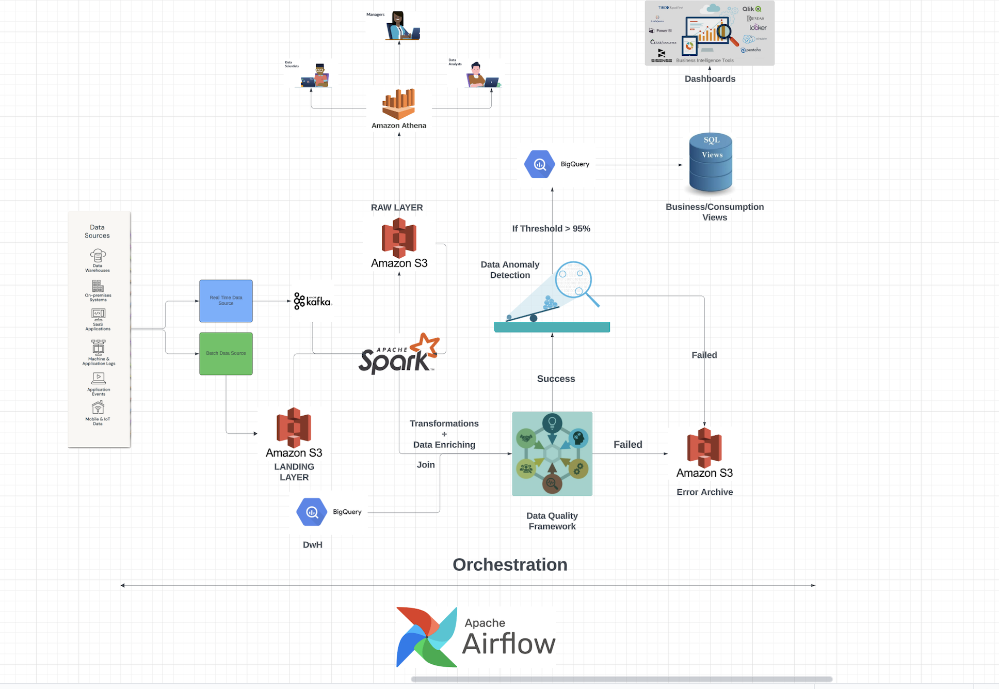

# AdvertiseX-Data-Engineering Case Study

The overall design for this case study has been segmented into following sections:
1) Integration
2) Ingestion/ETL
3) Data Quality Framework
4) Data Warehouse

For the purpose of simplicity the following design has been based on a cloud platform, to be more specific AWS, however the technologies used are generic mostly can be leveraged and so the design can be implemented with other cloud platforms like Azure or GCP as well. 

Building a data platform expands to multiple persona's, which includes but not limited to:
- Data Analysts
- Data Modellers
- Data Engineers
- Data Scientists
- Product Managers/Scrum Master
- DevOps Engineer

Each play a critical role at different stages of the project. Me as a data engineer, plays a crucial role ensuring that the data is made available to the downstream consumers in timely manner, and in the state that the business/technical team can make sense of, after removing any noise which is needed. 

Phase 1:
**Integration**:
Essentially bringing data from source into landing zone of the data platform. The consideration here is to create a solution which can be either event driven trigger or can be triggered in scheduled manner + having a serverless solution would help as it will reduce the maintenance overhead, hence I decided to pick AWS Lambda + ECS. This offers scalability and it can be triggered in multiple ways. 

**Storage**
Landing zone is on S3 its scalable, fault tolerant, cheap and has various policies to help restrict access + ways to manage object lifecycle with no restriction on the file format.

**Compute**
For pub/sub system I decided to go ahead with Kafka for multiple reasons, It provides scalable way of publishing and subscribing events from its topics, as its distributed across cluster. It also has fault tolerance with replication, and it can be configured to ensure there are records lost and additionally it supports basic transformation of data hence reducing load on downstream ystems.

For data processing, Spark is a good choice, as its one stop solution to multiple problems. Its distributed, resilient, fault toleran, its fast as it does in memory computation, supports multiple languages, it solves problem of batch + real time processing as well as it supports ML algo for example in our case anomaly detection in data. Its a matured tech with integration to various systems. 

**DwH**
For housing gold version of data, BigQuery seems to be a good choice, as it works well with BI tools, its designed to support large complex scalable queries and views which are the major source of powering dashboard. 
Redshift, could also have been an alternative, but its some times proven to be unreliable when it comes to large complex queries additionally, it requires manual effort to make table more optimised in redshift you need to periodically run scavanging ops which are expensive. 
Azure Synapse, in my opinion has had availability issues, hence BQ is the choice I decided for this purpose. 

**Data Exploration**
Since multiple teams need to explore data for their requirements, AWS Glue + Athena on S3 seems like a good choice. It reduces time for raw data to be made available for the other teams like product managers, DS. Its serverless, scalable, uses sql which is known by many users. 

